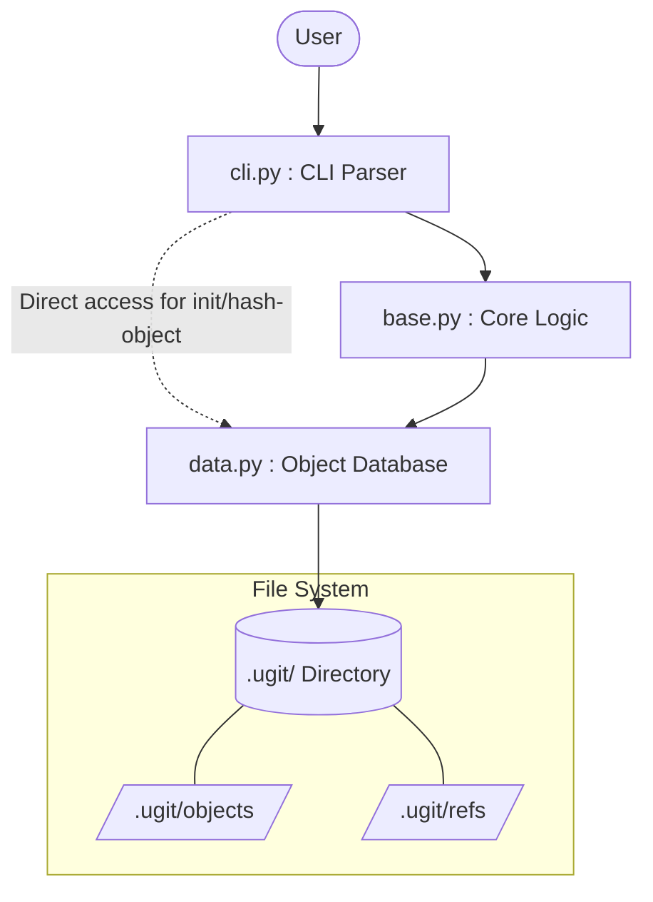

# `ugit` Architecture Overview

This document provides a high-level overview of the architecture of the `ugit` project—a minimalist version control system mimicking Git.

## Core Modules

The architecture is cleanly divided into three distinct layers, ensuring separation of concerns:

### 1. `ugit/cli.py` (The User Interface Layer)
This is the entry point of the application, responsible for parsing command-line arguments and translating them into actions.
- Uses `argparse` to handle subcommands like `init`, `hash-object`, `commit`, `checkout`, `branch`, `tag`, `log`, etc.
- Converts string arguments into appropriate types (e.g., resolving aliases like `@` to their actual object IDs using `base.get_oid`).
- Defers all actual operations to `base.py` or `data.py`.

### 2. `ugit/base.py` (The Business Logic Layer)
This module acts as the orchestrator. It knows about the semantics of versions and commits, but it doesn't directly interact with the file system for storage.
- **Tree Operations**: `write_tree` (hashes directory structures) and `read_tree` (restores directory structures into the working directory).
- **Commit Operations**: `commit` (creates a commit object pointing to a tree) and `checkout` (restores a specific commit).
- **History Navigation**: `iter_commits_parents` (traverses commit history) and `get_commit`.
- **References**: `create_tag` and `create_branch`.
- **Object Resolution**: `get_oid` (resolves names like `HEAD`, tag names, or branch names to object hashes).

### 3. `ugit/data.py` (The Data Storage Layer)
This is the lowest level of the system, handling the physical storage of objects and references in the `.ugit` directory. It does not know what a "tree" or "commit" actually implies; it just treats them as bytes.
- **Repository Initialization**: `init` (creates `.ugit` and `.ugit/objects`).
- **Object Storage**: `hash_object` and `get_object`. Objects are stored using their SHA-1 hashes, compressed with a null-byte separator (e.g., `blob\x00<content>`).
- **References**: `update_ref`, `get_ref`, and `iter_refs`. Resolves and updates pointers like `HEAD`, branch heads, and tags. Supports symbolic references (e.g., `HEAD` pointing to `ref: refs/heads/master`).

## Object Database Architecture (`data.py`)

The Object Database is the storage engine of `ugit`. It operates purely on byte sequences and has no concept of what the data represents (other than a loosely enforced `type` string). 

### 1. Object Storage (`.ugit/objects/`)
Every piece of data tracked by `ugit`—whether it's a file's content, a directory structure, or a commit message—is stored as an **object** in this directory.
- **Content-Addressable Storage**: Objects are named based on the SHA-1 hash of their contents. This guarantees data integrity and automatic deduplication (two identical files will hash to the same ID and be stored once).
- **Object Format**: When an object is saved via `hash_object`, it is formatted with a header before being hashed and stored:
  ```
  <type> \x00 <data_bytes>
  ```
  For example, a text file's object might look like: `blob\x00Hello World`.
- **Supported Types**: Although `data.py` accepts any type string, the core logic currently generates three types:
  - `blob`: Raw file contents.
  - `tree`: Directory listings (mapping filenames to other `blob` or `tree` object IDs).
  - `commit`: Metadata linking a `tree`, a `parent` commit, and a message.

### 2. References (`.ugit/refs/` and `.ugit/HEAD`)
While object IDs (SHA-1 hashes) are permanent, they are difficult for humans to remember. **References (refs)** are mutable, human-readable pointers to object IDs.
- **Direct References**: Files containing a 40-character SHA-1 hash. Examples include branches (e.g., `.ugit/refs/heads/main`) and tags (e.g., `.ugit/refs/tags/v1.0`).
- **Symbolic References**: Files pointing to *other* references instead of direct hashes. They are identified by the `ref: ` prefix. For example, `.ugit/HEAD` typically contains `ref: refs/heads/main`, meaning "the current working state is on the main branch."


## Data Flow Example: `ugit commit -m "Message"`

1. **User Input**: The user runs `ugit commit -m "Message"`.
2. **CLI Parsing**: `cli.py` parses the arguments and calls `base.commit("Message")`.
3. **Core Logic**:
   - `base.commit` calls `base.write_tree()` to snapshot the current working directory.
   - `base.write_tree` traverses the directory and calls `data.hash_object` for each file and directory.
   - `base.commit` retrieves the current `HEAD` parent commit via `data.get_ref("HEAD")`.
   - It formats a commit string containing the tree ID, parent ID, and message.
4. **Data Storage**:
   - `base.commit` calls `data.hash_object` to save the commit object.
   - It then updates `HEAD` to point to the new commit using `data.update_ref`.

## Diagram


